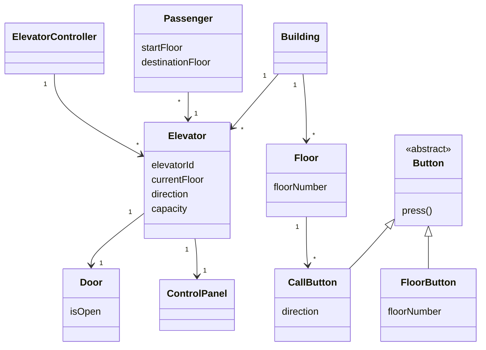

## 🛗 Elevator Simulation System – Class Diagram

# 🛗 Elevator Simulation System

This repository contains an **object-oriented design** and a **basic simulation skeleton**
for modeling elevator operations in a multi-floor office building.

The purpose of this project is to demonstrate **Object-Oriented Programming (OOP) principles**
such as encapsulation, inheritance, polymorphism, and abstraction.

---

## 📌 Problem Description

A 12-floor office building is equipped with **5 energy-efficient elevators**.
Each elevator:
- Can travel to all floors
- Has a maximum capacity of 6 passengers
- Moves only when needed to save energy

A software simulator is designed to analyze whether the elevator system can
handle building traffic efficiently.

---

## 🧱 System Components

### Building
- Contains all elevators and floors

### Elevator
- Tracks current floor and direction
- Moves between floors when assigned
- Has a door, control panel, and indicator light

### Floor
- Contains call buttons (up / down)
- Has arrival bell and signal light

### Control Panel
- Floor selection buttons
- Door open / close buttons
- Emergency button

### Button Hierarchy
- **Button (abstract)**
- **CallButton** (up / down)
- **FloorButton** (destination selection)

### Passenger
- Has a starting floor and a destination floor

### Elevator Controller
- Assigns the most suitable elevator to a request
- Manages elevator movement

---

## 📊 UML Class Diagram

The system design is represented using a **UML Class Diagram**.

- `Button` is modeled as an abstract class
- `CallButton` and `FloorButton` inherit from `Button`
- Elevator behavior is coordinated by `ElevatorController`

The UML diagram is embedded directly in this README using **Mermaid**.

---

## 💻 C# Implementation

A simplified **Program.cs** file is provided to reflect the UML design.

- All classes are defined in a single file
- No advanced scheduling algorithms are implemented
- Focus is on structure rather than full simulation logic

---

## 🧠 OOP Principles Used

- **Encapsulation**: Each class manages its own state and behavior
- **Inheritance**: Button hierarchy
- **Polymorphism**: Different button types share a common interface
- **Abstraction**: Abstract base classes and controller pattern

---

## 🚀 Possible Improvements

- Implement real-time simulation loop
- Add queue-based elevator scheduling
- Handle multiple passengers simultaneously
- Add logging and time-based events
- Split classes into separate files

---

## 👤 Author

Created as an Object-Oriented Programming (OOP) practice project.
